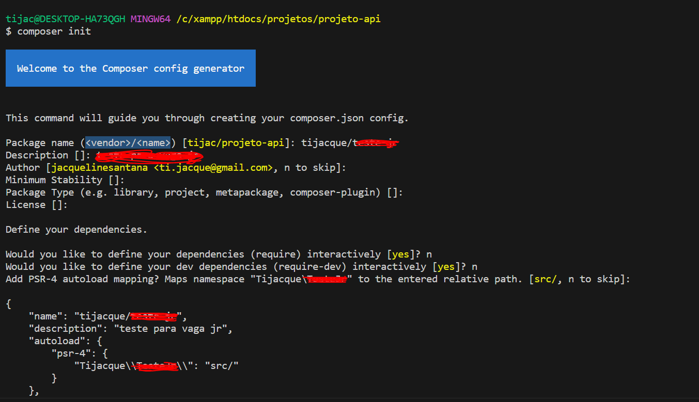
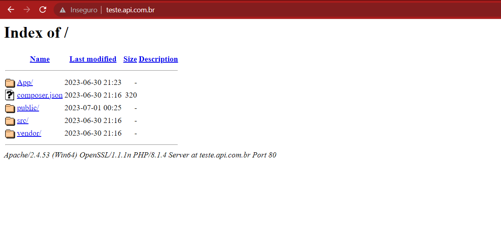
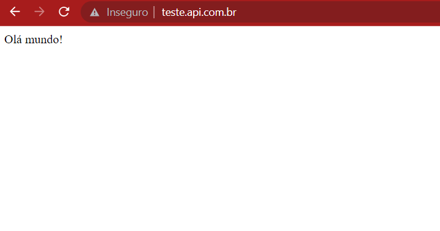

# PHP API sem framework - POO

Bem vindo a esse material de apoio e estudo aos amantes de PHP e POO, a ideia aqui é criar uma API com endpoints de consumo e login, vamos criar tudo sem utilizar de bibliotecas assim como faziam os Maias e Astecas, rs, brincadeiras a parte vamos de código, mas antes vamos falar um pouco sobre quais são os conteúdos que você precisa conhecer antes de entrar nesse pequeno barquinho:

1. conhecimentos em PHP
2. conhecimentos em POO
3. conhecimentos em MVC - desejável 
4. conhecimentos em API - o que é ..
5. conhecimentos em composer - básico
6. Ter PHP, Mysql, Composer tudo bonitão instalado em sua máquina.
7. vou utilizar aqui o Visual Studio Code para desenvolvimento da API, mas se vc conhece e se sente mais confortável com outra ferramenta, fique a vontade.

## Preparando o ambiente

Para começar nossa aventura "PHPatíca" vamos criar o nosso projeto e para isso, dentro do seu ambiente de desenvolvimento Xampp, Wampp ou o que você achar mais interessante vamos criar nossa pasta do projeto e abrir a ferramenta que vamos iniciar os trabalhos, no meu caso o Visual Studio, vale lembrar que se vc usa o Xampp o endereço será dentro da pasta htdocs do Xampp -  eu criei uma pasta projetos/api mas fique a vontade para dar outro nome caso julgue melhor.

1. vamos iniciar abrindo o terminal do nosso Visual Studio dentro da pasta do projeto e vamos utilizar o comando `composer init`
2. vamos responder as perguntas = nome do desenvolvedor/api - exemplo: `tijacque/api`
3. descrição do projeto você pode preencher ou deixar em branco sem problemas
4. em dependências vou deixar como `não`
5. em bibliotecas também vou informar `não`
6. confirmo a geração do json

Até o momento seguimos da seguinte forma:



7. no arquivo Json gerado vou alterar src para App e salvar o arquivo.

8. dentro da pasta do projeto também vou adicionar a pasta App.

9. dentro da pasta App vamos adicionar 3 pastas = Controllers/ Models/ e Core/ - todas dentro do diretório App

10. na raiz do projeto vamos criar a pasta public e dentro dessa nosso primeiro arquivo PHP - index.php com um um texto simples para ser printado na tela, adivinhem qual texto? Sim! Hello

11. feito isso vamos preparar o ambiente para executar nossa aplicação: vamos alterar o arquivo Hosts o caminho dele é: c:\\Windows\System32\drivers\etc\hosts

    1. para esse arquivo vamos adicionar uma linha com seu IP local e o endereço da sua api ex: 127.0.0.1       teste.api OBS note que seu arquivo hosts já tem alguns exemplos.
    2. salve as alterações como admin 

12. agora vamos alterar o arquivo httpd-vhosts.conf este arquivo esta dentro do seu pacote de serviços Xampp ou Wampp, para o Xampp o caminho é: c:\\xampp\apache\conf\extra\httpd-vhosts.conf  

    1. esse arquivo já vem com alguns modelos comentados de como vamos adicionar essa virtualhost mas basicamente vamos substibuir as informações onde esta o endereço exemplo para `teste.api.com.br` que é o endereço que eu criei para minha aplicação.
    2. note que o exemplo estará comentado e o que vamos acrescentar, vamos remover o comentário para ser aplicado,
    3. feito isso vamos salvar o arquivo

    exemplo:

    ```
    <VirtualHost *:80>
        ServerAdmin rleme@teste.api.com.br
        DocumentRoot "C:\xampp\htdocs\projetos\projeto-api"
        ServerName teste.api
        ErrorLog "logs/teste.api.com.br-error.log"
        CustomLog "logs/teste.api.com.br-access.log" common
    </VirtualHost>
    ```

13. após essas alterações pare e inicie novamente o serviço do seu pacote Xampp ou Wampp

14. após esses ajustes vamos abrir no navegador o endereço definido para sua api, no meu caso: teste.api.com.br

resultado esperado:



Tudo funcionando, agora só precisamos iniciar nova navegação dentro da pasta public, para isso vamos adicionar um arquivo .htaccess na raiz do projeto.

```
RewriteEngine On
RewriteBase /

RewriteCond %{THE_REQUEST} public/([^\s?]*) [NC]
RewriteRule ^ %1 [L,NE,R=302]
RewriteRule ^((?!public/).*)$ public/$1 [L,NC]
```

o código acima deve resolver a questão e direcionar sempre o inicio da navegação para pasta public/, faça o teste recarregando o seu navegador para a sua url, resultado esperado:



Dentro do diretório public/ também vamos incluir um arquivo .htaccess para já irmos ajustando esse ambiente. Esse arquivo ficará:

```
RewriteEngine On
RewriteCond %{REQUEST_FILENAME} !-f
RewriteCond %{REQUEST_FILENAME} !-d
RewriteRule ^(.*)$ index.php
```

## Sobre o namespace

O namespace de um projeto deve preferencialmente atender as regras da PSR4, sendo assim para não ter problemas na hora de escrever esse parametro, utilize o json gerado com seu projeto, veja como foi criado o namespace do meu projeto:

```
{
  "name": "tijacque/testando",
  "description": "teste de name-space",
  "autoload": {
    "psr-4": {
      "Tijacque\\Testando\\": "src/"
    }
  },
  "authors": [
    {
      "name": "jacquelinehernandes",
      "email": "ti.jacque@gmail.com"
    }
  ],
  "require": {}
}
```

Acima temos o arquivo completo, mas vou destacar agora uma parte em especial que vai ajudar e muito a manter seu projeto bem estruturado já atendendo esse critério das boas práticas:

```
"psr-4": {
      "Tijacque\\Testando\\": "src/"
 }
```

Ai esta a parte que geralmente faz iniciantes em PHP perder o sono, veja que seu projeto já foi criado no `composer init` com o padrão Psr -4, então essa linha esta já passando que suas classes devem ter o namespace iniciado por esse valor, que para meu projeto será Tijacque\Testando essa estrutura de namespace vai servir para encontrar arquivos do diretório src do seu projeto, então ao declarar uma classe que esta dentro da src não precisamos indicar seu caminho com o src\pasta\classe... vamos colocar Tijacque\Testando\diretório\Classe respeitando letras em caixa alta e as de caixa baixa.

Para tornar o entendimento dessa parte mais visual, veja a imagem da minha estrutura de arquivos, *obs apenas olhe a estrutura para seguir como base, não precisa replicar em seu projeto*:


Conforme a imagem, podemos notar que temos o diretório src, dentro do mesmo temos a pasta Core, dentro dessa pasta temos a classe Router.php.

Para a escrita do namespace dessa classe teremos que passar então:

```
<?php
namespace Tijacque\Testando\Core;
class Router{
```

Quando for necessário chamar/ instanciar essa classe vamos passar:

```
new Tijacque\Testando\Core\Router(); 
```

Nomeando as partes:

`Tijacque\Testando\` = Namespace principal/ vendor namespace que leva ao seu diretório base o src

`Core` = sub-namespace que vai seguir conforme sua organização de estrutura do projeto. Aqui poderiamos ter mais de um valor, **caso minha estrutura estivesse no formado Diretório/Core, passaríamos como sub-namespace Diretório/Core**.

`Router()` = nome da classe que queremos acessar.


